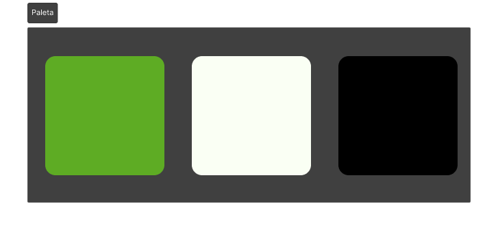
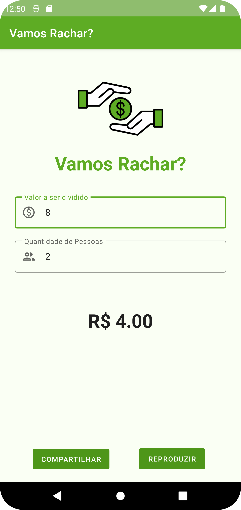
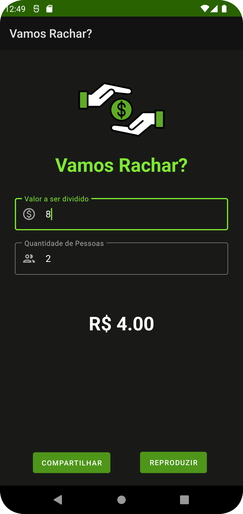

# Vamos Rachar? :purse:

> **Aluna:** Yanna Torres
>
> **Matrícula:** 507773
>
> **Disciplina:** Programação para Dispositivos Móveis (SMD0122)
>
> **Professor:** Dr. Windson Viana
 
**Sumário: [A Atividade](#a-atividade-page_with_curl) • [Ícone, Paleta de Cores e Novo Layout](#ícone-paleta-de-cores-e-novo-layout-paintbrush) • [Calculando o resultado](#calculando-o-resultado-abacus) • [Compartilhando o resultado](#compartilhando-o-resultado-postbox) • [Reproduzindo o resultado](#reproduzindo-o-resultado-loud_sound) • [Resultados](#resultados-play_or_pause_button) •**

## A atividade :page_with_curl:

Você deve fazer um aplicativo que facilite a vida de quem vai dividir a conta no restaurante com os amigos. Ele pode ter apenas uma única tela conforme mostrado no final do vídeo da aula gravada (Parte 2).
As features principais são:
1. **(2 pontos)** - Por enquanto, o aplicativo só faz divisões do valor pelo número de pessoas
2. **(2 pontos)** - Mas ele já tem um ícone
3. **(2 pontos)** - Já permite o compartilhamento do valor final
4. **(2 pontos)** - Fala o valor calculado usando TTS
5. **(2 pontos)** - O usuário não precisa clicar para calcular, ele já faz automaticamente após o preenchimento dos campos de valor e número de pessoas

## Ícone, Paleta de Cores e Novo Layout :paintbrush:

### Ícone e Paleta de Cores :art:

Como pedido, foi criado um ícone para o aplicativo. O ícone são duas mãos trocando dinheiro, retirado do site [Flaticon]([https://www.flaticon.com/br/icone-gratis/combustivel_1505662?term=gasolina&page=1&position=18&origin=search&related_id=1505662](https://www.flaticon.com/br/icone-gratis/a-receber_10842272?related_id=10842272)), que fornece ícones de forma gratuita.

Com base nas cores do ícone, foi definida uma paleta de cores base que ficasse harmoniosa com o ícone e representasse o assunto do app. Dentro do app, porém, há mais cores derivadas de variações e ajustes para cada tema.

| **Ícone**  | **Paleta de Cores** |    
| ------ | --------------- |
|       |  |

### Novo layout e temas :woman_artist:

Com base no tópico anterior, foi criado dois temas, _claro_ e _escuro_, com um layout simples, contendo apenas o ícone, os campos de texto, o resultado e os botões de ação.

|  |  |
| ------ | --------------- |

## Calculando o resultado :abacus:

O código a seguir é o responsável por calcular o resultado da parte de cada pessoa. Como pedido, o cálculo acontece automaticamente e, para isso ocorrer, a classe `MainActivity` realiza a inferface `TextWatcher`.

Além disso, para garantir que o resultado apareça em um formato "monetário", foi inserido um formatador de texto decimal. A seguir, o corte que da parte do código relacionada a essa funcionalidade:

```kotlin
class MainActivity : AppCompatActivity(), TextToSpeech.OnInitListener, TextWatcher {
    /*
        Rest of the code
    */
    private var resultValue : Double = 0.00
    private val df = DecimalFormat("0.00")
    private lateinit var priceInput : EditText
    private lateinit var peopleInput : EditText
    private lateinit var resultTxt : TextView

    override fun onCreate(savedInstanceState: Bundle?) {
        super.onCreate(savedInstanceState)
        setContentView(R.layout.activity_main)

        // Initializing components variables
        priceInput = findViewById<EditText>(R.id.totalTxt)
        peopleInput = findViewById<EditText>(R.id.peopleTxt)
        resultTxt = findViewById<TextView>(R.id.resultTxt)

        // Adding TextWatchers
        priceInput.addTextChangedListener(this)
        peopleInput.addTextChangedListener(this)

        /*
            Rest of the code
        */
    }

    /*
        Rest of the code
    */

    override fun beforeTextChanged(p0: CharSequence?, p1: Int, p2: Int, p3: Int) {
        Log.d("PDM23","Antes de mudar")
    }

    override fun onTextChanged(p0: CharSequence?, p1: Int, p2: Int, p3: Int) {
        Log.d("PDM23","Mudando")
    }

    override fun afterTextChanged(p0: Editable?) {
        updateResult()
    }

    private fun updateResult() {
        if (priceInput.text.isNotEmpty() and peopleInput.text.isNotEmpty()) {
            val billPrice : Double = priceInput.text.toString().toDouble()
            val people : Double = peopleInput.text.toString().toDouble()

            if (people > 1) {
                resultValue = billPrice / people
                val txt : String = "R$ ${df.format(resultValue)}"
                resultTxt.text = txt
            } else {
                resultTxt.text = "A quantidade de pessoas deve ser maior que 1"
            }
        }
    }
}
```

## Compartilhando o resultado :postbox:

A segunda funcionalidade implementada foi a de compartilhamento da parte de cada indivíduo. Para isso, foi implementada internamente a função `setOnClickListener` nativa dos botões o processo de compartilhamento. A mensagem de compartilhamento foi customizada para deixar claro que o valor que será enviado é a parte da outra pessoa na conta e não a conta inteira.

```kotlin
class MainActivity : AppCompatActivity(), TextToSpeech.OnInitListener, TextWatcher {
    
    /*
        Rest of the code
    */

    override fun onCreate(savedInstanceState: Bundle?) {
        super.onCreate(savedInstanceState)
        setContentView(R.layout.activity_main)

        // Initializing components variables
        val shareBtn = findViewById<Button>(R.id.shareBtn)
        val talkBtn = findViewById<Button>(R.id.playBtn)

        /*
            Rest of the code
        */

        // Sharing result
        shareBtn.setOnClickListener {
            val textResult = resultTxt.text.toString()
            val textToShare = "Vamos Rachar? \n Sua parte da conta: $textResult"
            if (textToShare.isNotEmpty()) {
                val sendIntent = Intent().apply {
                    action = Intent.ACTION_SEND
                    putExtra(Intent.EXTRA_TEXT, textToShare)
                    type = "text/plain"
                }

                val shareTitle = "VamosRachar"
                val shareIntent = Intent.createChooser(sendIntent, shareTitle)
                startActivity(shareIntent)
            }
        }
    }

    /*
        Rest of the code
    */
}
```

## Reproduzindo o resultado :loud_sound:

Por fim, a funcionalidade de reproduzir o resultado foi implementada utilizando a interface `TextToSpeech`. Para garantir que o que fosse falado tivesse algum sentido, houve um pré-processamento através da função `speakResult()` do que deveria ser falado para soar da mesma forma que uma pessoa iria dizer o valor ("1 real e 30 centavos" ou "0 reais e 99 centavos").

```kotlin
class MainActivity : AppCompatActivity(), TextToSpeech.OnInitListener, TextWatcher {
    private lateinit var tts : TextToSpeech
    /*
        Rest of the code
    */

    override fun onCreate(savedInstanceState: Bundle?) {
        super.onCreate(savedInstanceState)
        setContentView(R.layout.activity_main)
        
        /*
            Rest of the code
        */

        // Initializing the tts
        tts = TextToSpeech(this, this)

        // Call TTS for value result
        talkBtn.setOnClickListener(View.OnClickListener {
            speakResult()
        })

        /*
            Rest of the code
        */
    }

    
    private fun speakResult(){
        val integerPart = floor(resultValue).toInt()
        val decimalPart = ((resultValue - integerPart) * 100).toInt()

        val integerPartSpoken = when {
            resultValue == 0.0 -> "0 reais"
            integerPart == 1 -> "1 real"
            integerPart > 1 -> "$integerPart reais"
            else -> ""
        }
        val decimalPartSpoken = if (decimalPart > 0) "e $decimalPart centavos" else ""

        val spokenResult = "$integerPartSpoken $decimalPartSpoken"
        tts.speak(spokenResult, TextToSpeech.QUEUE_FLUSH, null, null)
    }

    override fun onInit(status: Int) {
        if (status == TextToSpeech.SUCCESS) {
            tts.language = Locale.getDefault()
            Log.d("PDM23","TTS engine initialized successfully")
        } else {
            Log.e("PDM23", "Failed to initialize TTS engine.")
        }
    }
    override fun onDestroy() {
        // Release TTS engine resources
        tts.stop()
        tts.shutdown()
        super.onDestroy()
    }
    /*
        Rest of the code
    */
}
```

## Resultados :play_or_pause_button:


