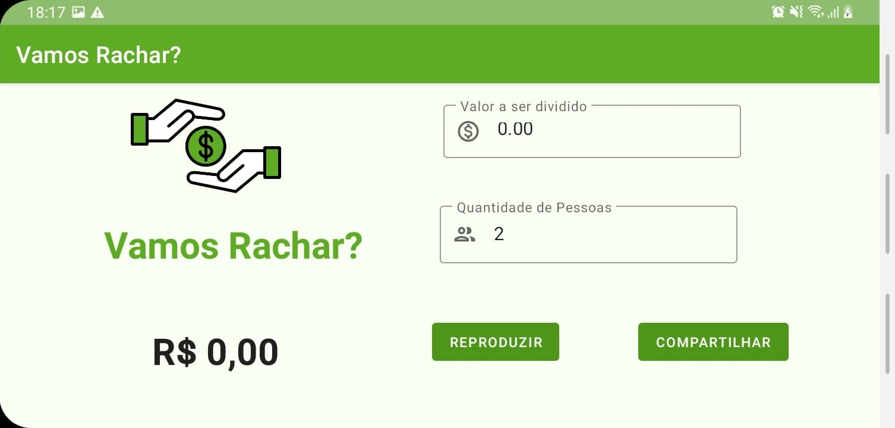
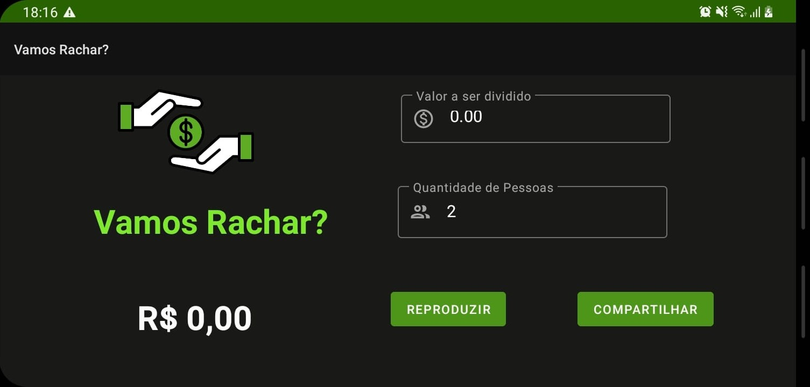
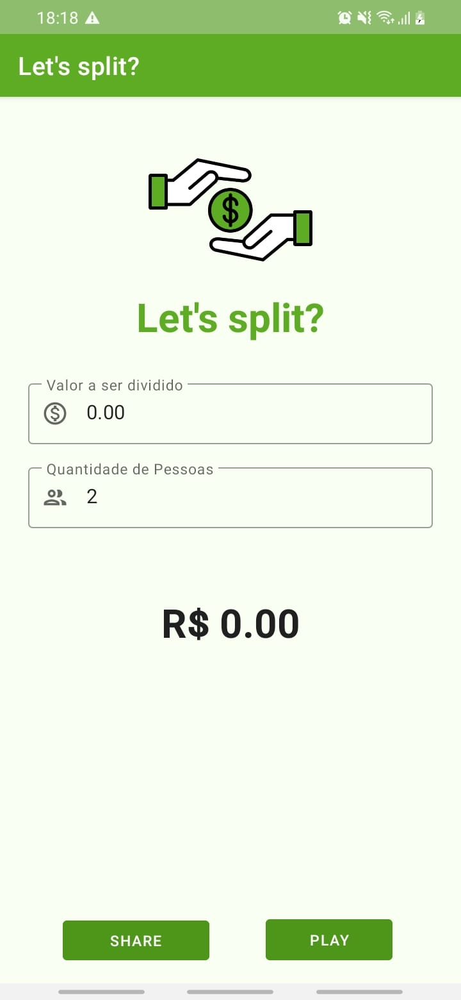
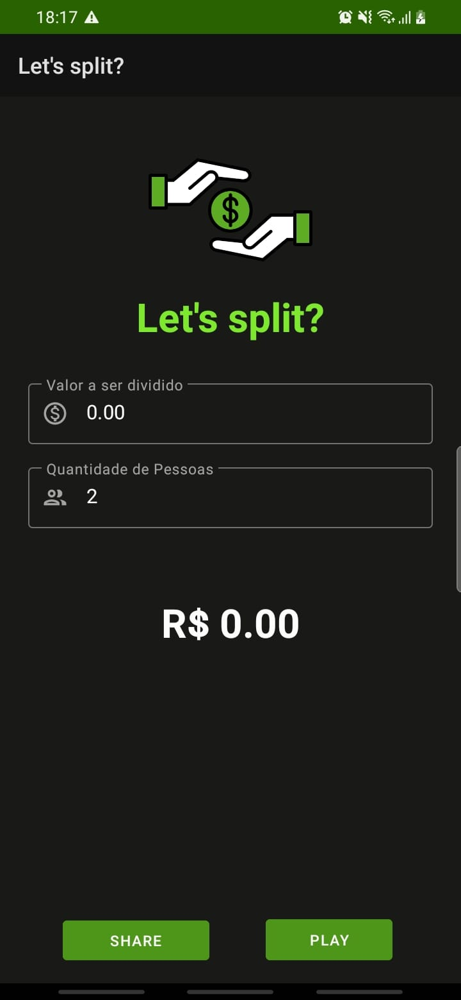
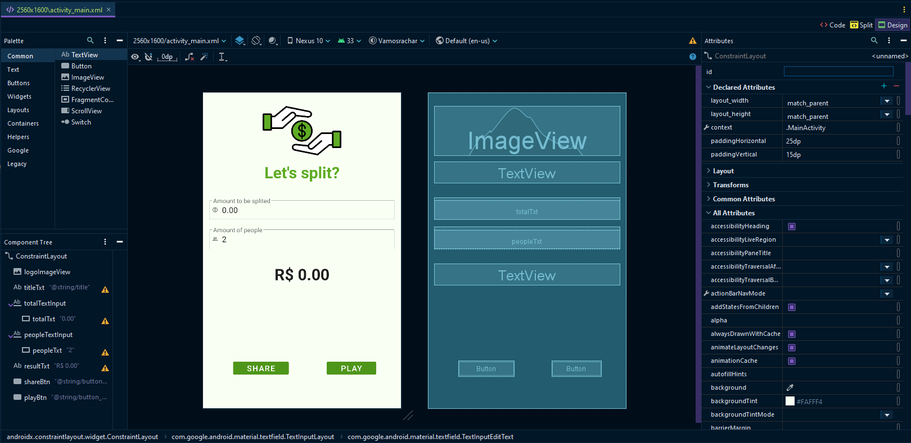
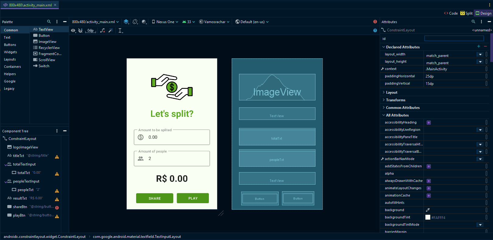

# Vamos Rachar? (Adaptativo) :purse:

> **Aluna:** Yanna Torres
>
> **Matrícula:** 507773
>
> **Disciplina:** Programação para Dispositivos Móveis (SMD0122)
>
> **Professor:** Dr. Windson Viana
 
**Sumário: [A Atividade](#a-atividade-page_with_curl) • [Ícone, Paleta de Cores e Novo Layout](#ícone-paleta-de-cores-e-layouts-paintbrush) • [Suporte para várias línguas](#suporte-para-várias-línguas-book) • [Suporte a duas classes de Tamanho de Tela](#suporte-a-duas-classes-de-tamanho-de-tela-iphone) •**

## A atividade :page_with_curl:

Após ver os vídeos e links, modifique as aplicações Vamos Rachar! e Álcool ou Gasolina para que elementos da sua interface se adaptem de acordo com os seguintes qualificadores:
1. **(2.5 pontos)** - Orientação do Dispositivo
2. **(2.5 pontos)** - Para duas classes de Tamanho da Tela do dispositivo
3. **(2.5 pontos)** - Para duas Línguas diferentes (e.g., Inglês e Português)
4. **(2.5 pontos)** - Para lidar com o modo noturno

## Ícone, Paleta de Cores e Layouts :paintbrush:

### Ícone, Paleta de Cores e Modo Escuro :art:

Na primeira versão deste app, já existia o ícone e uma paleta de cores definida que pode ser encontrada a seguir.

| **Ícone**  | **Paleta de Cores** |    
| ------ | --------------- |
|       |  |

Também derivado da primeira versão, foi reaproveitado os temas _claro_ e _escuro_.

|  |  |
| ------ | --------------- |

### Novo layout: Landscape :woman_artist:

Como requistito desta entrega, foi criado, com base nos tópicos anteriores, um novo layout para a versão horizontal do app, disponível nos dois temas.

|   |
|----------------------------------------|
|  |

## Suporte para várias línguas :book:

Continuando a aplicação dos requisitos da tarefa, agora o app Vamos Rachar? possui suporte ao inglês e ao português (br). A seguir você pode encontrar os prints do app quando na língua inglesa.

|  |  |
|----------------------------------------------|----------------------------|

## Suporte a duas classes de Tamanho de Tela :iphone:

Por fim, o app também possui suporte a tamanhos variados de tela, mais especificamente para as dimensões do Nexus S (480x800) e do Nexus 10 (2560x1600).

|   |
|------------------------------------|
|  |